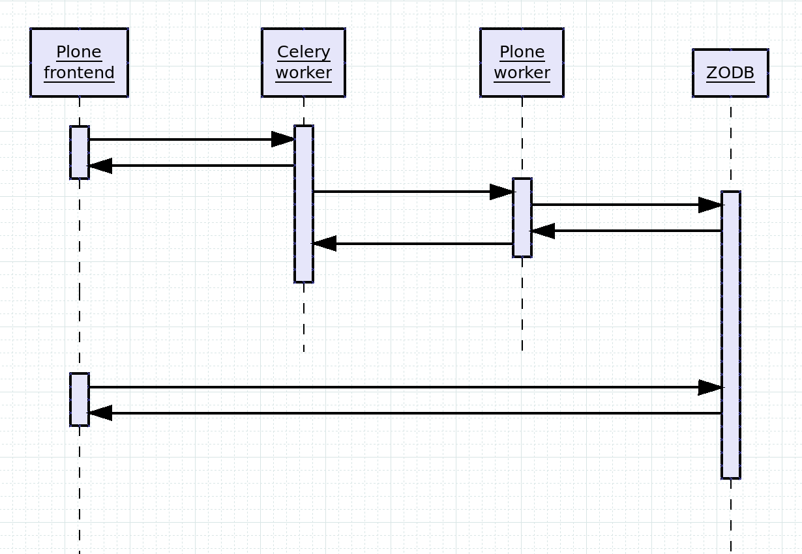

==========================
Asynchronous Functionality
==========================

The `ploneintranet.async` package aims to facilitate a rich,
responsive user experience by offloading long running tasks to a worker instance of Plone.

For example document previews are generated when new documents are uploaded.
This happens asynchronously to free up the user's browser for other tasks.
and user notifications arrive in the browser without user interaction.

Similarly, a fast autosave roundtrip is realised by not reindexing the edited
page on each edit directly, but deferring the reindexing to an async worker.

Architecture
============

The model we've chosen is both simple and powerful:
async jobs to be performed, are executed as HTTP requests against a Plone worker.

This provides several benefits:

* Ensures asynchronous jobs can still be performed as if the original user had initiated them.
* Makes it easy to implement an async task, since it is just a normal Plone browser view.
* Makes it easy to debug any issues as the tasks themselves are just HTTP requests.
* Removes the need to give Celery access to the ZODB directly.
* Simplifies deployment, since there is no need for specially-configured async workers -
  everything runs in Plone instances.

Call flow
---------

The following diagram illustrates the call flow:

1. A Plone frontend serves a view which needs to offload some costly processing.
2. The frontend delegates that task to Celery.
3. Celery immediately returns, so the initial view can be rendered to the user.
4. Celery dispatches the job to a Plone worker.
5. The Plone worker commits the result to the ZODB.
6. (ZODB returns. Plone worker returns).

At this stage, the original sequence is finished, and the job you would normally
perform synchronously has been executed asynchronously and committed to the database, so any following views have access to the results:

7. A later view on the Plone frontend accesses the ZODB.
8. The ZODB returns a result that includes the async job modifications done above.

Deployment
==========

Redis
-----

You need a Redis_ server to store the async messaging queue.
For security reasons, we recommend this be installed as a system service so as to be maintained by sysadmin,
rather than adding it to buildout where it risks not having security patching performed.

On Ubuntu: `sudo apt-get install redis-server`.

.. _Redis: http://redis.io

Celery
------

Async is provided by `Celery`_. Celery is a proven, pure python, distributed task queue.

Celery is included as a dependency in the ploneintranet buildout and is typically run
from supervisor. You can run it manually for debugging purposes as follows::

   bin/celery -A ploneintranet.async.celerytasks worker -l info

(or `-l debug` if you want more verbose logging info)

.. _Celery: http://www.celeryproject.org/

Plone Workers
-------------

The diagram above distinguishes between 'Plone frontend' and 'Plone worker' but that's
not really a requirement. You can run async on a single instance and it will work fine
without ZEO: the worker job gets executed by the same instance as soon as the original
view is rendered and the instance becomes available.

In a production environment, you would typically use a ZEO setup with multiple Plone instances.
Async jobs get executed as HTTP calls on the normal portal URL, which is important since it
enables HAProxy to keep track of the load on each instance.

You may want to designate special workers, separate from user-facing frontends, so that any
queue buildup of costly processing jobs does not degrade user view performance.
You can route async requests to special workers using the `X-celery-task-name: your_task_name`
HTTP header set by ploneintranet.async using either Nginx rewrites or HAProxy config.
You could even maintain separate worker pools for high-priority and low-priority async jobs,
distinguished by their task names. YMMV.

If you're running multiple servers (virtuals) with Plone, each of those needs to have Redis
and Celery running.

@@async-status audit view
-------------------------

A special helper view `{portal_url}/@@async-status` implements a self-test on the async functionality.

If the unit tests pass but this one doesn't, it's a deployment issue.

Adding a new async task
=======================

If you're a Plone Intranet developer, it is very easy to add a new async task
or to convert an existing piece of functionality into an async job.

Let me walk you through the stack using a working example: performing async
object reindexes.

The key thing to understand is, that this is a 3-step process:
1. Prepare the async delegation in Plone.
2. Trigger the delayed http request in Celery.
3. Execute the actual job in Plone.

We're maintaining Plone task preprocessors (1) in a separate module `ploneintranet.async.tasks`
to distinguish them from the Celery tasks (2), which are maintained in `ploneintranet.async.celerytasks`.

1. Task preprocessor
--------------------

The reason we need to pre-process is, that Celery in step 2 does not have access to
anything in Plone, so we need to convert any object references into strings we can pass to Celery.

In `ploneintranet.async.tasks`:

.. code-block:: python

  from ploneintranet.async import celerytasks
  from ploneintranet.async.interfaces import IAsyncTask
  from ploneintranet.async.core import AbstractPost

  @implementer(IAsyncTask)
  class ReindexObject(AbstractPost):
    """Reindex an object asynchronously."""
    """

    task = celerytasks.reindex_object
    url = '/@@reindex_object'

That's it. Note that the `task` and `url` point forward to the Celery task and
worker view we'll set up in steps 2 and 3 below.

All the heavy lifting here is done in `AbstractPost`, which:

* Extracts login credentials from the current request
* Sets up a `plone.protect`_ `authenticator`
* Adds a `X-celery-task-name` http header
* Munges the given relative url into an absolute url on the current context object 

.. note:: Adding a new preprocessor is as simple as subclassing `AbstractPost`
          and setting the `task` and `url` properties.

2. Celery task
--------------

The Celery task for our reindex job is very simple:

.. code-block:: python

  from ploneintranet.async.core import dispatch

  @app.task
  def reindex_object(url, data={}, headers={}, cookies={}):
    """Reindex a content object."""
    dispatch(url, data, headers, cookies)

As you can see, this is just a wrapper that turns a `dispatch` call
into a Celery task. `app` is the Celery API that is set up in
`ploneintranet.async.celerytasks`.

.. note:: Adding a new Celery task is as simple as creating a function
          that calls `dispatcher`, and decorating that function with `@app.task`.

3. View that executes the job
-----------------------------

The actual execution of an async job is handled by a normal Plone view.
Since this is the code that will interact with the Plone database, you need to take
care to not take any security shortcuts here, which means:

* Register the view with proper view permissions
* **Do not disable CSRF protection!** 

Think about it: we're cloning an original request and then re-use those credentials
to fire off a new request, that will result in a database write.
That's about the definition of a Cross-Site Request Forgery.

ploneintranet.async plays nice with `plone.protect`_ and adds an authenticator
to the async request to prove that it's not an attack.

If you're developing and debugging the worker view, you're missing that authenticator
(it gets added in the preprocessor step which you're skipping if you hit the worker view directly.)
So you need to add that to help debugging without compromising security.

Here's the implementation (see `ploneintranet.async.browser.views`):

.. literalinclude:: ../../../src/ploneintranet/async/browser/views.py

The corresponding view template is as follows:

.. literalinclude:: ../../../src/ploneintranet/async/browser/templates/protected.pt
                    :language: xml

Finally, the view is registered for `cmf.ModifyPortalContent` since only users
with write access should be allowed to trigger a reindex.

.. code-block:: xml

  <browser:page
      name="reindex_object"
      for="*"
      class=".views.ReindexObjectView"
      permission="cmf.ModifyPortalContent"
      layer="..interfaces.IPloneintranetAsyncLayer"
      />

.. note:: The actual business logic for executing an async task can be developed
          as a normal Plone view which you can access directly.

.. _plone.protect: https://pypi.python.org/pypi/plone.protect

Calling the task
----------------

Now the async job pipeline is setup, all you have to do is to import the task preprocessor
in your own view code somewhere, and calling it:

.. code-block:: python

  from ploneintranet.async import tasks
  tasks.ReindexObject(self.context, self.request)()

.. note:: Triggering an async job is as simple as instantiating and then
          calling the preprocessor task you prepared above in step 1.

Note the final parentheses, wich is a `__call__` that takes various extra arguments
with which you can tune both the `requests.post` and the `celery.apply_async` calls
that are taking place under the hood.

A fictitious call to a view that expects form arguments, which is called with a delay
of two seconds, could for example look like:

.. code-block:: python

  tasks.GoNuts(self.context, self.request)(data={'nut':'hazel'}, countdown=2)

See the `IAsyncTask` interface for the full API:

.. autointerface:: ploneintranet.async.interfaces.IAsyncTask
                   :members:
                   :special-members:
                   :member-order: bysource

Re-using ploneintranet.async outside of ploneintranet
=====================================================

Celery is typically set up as follows:

* a `celeryconfig` module contains the configuration
* a `celerytasks` module loads that configuration module and creates an `app`
* a Celery `worker` is then run against the `celerytasks` module.

Because of the way Celery wraps tasks in decorators and is quite picky about
names and module paths, this means that you cannot import anything from the
`ploneintranet.celerytasks` module.

However, we factored the heavy lifting infrastructure out into a separate 
`ploneintranet.async.core` module which you can easily use to build your own
Celery tasks:

* `ploneintranet.async.core.AbstractPost` is a generic engine for creating task preprocessors. See above how little work is required to subclass it into a custom preprocessor.
* `ploneintranet.async.core.dispatch` is a generic engine for executing http requests from Celery.

.. note:: By importing `ploneintranet.async.core` you can easily create your own
          `tasks` preprocessors and `celerytasks`.

.. autoclass:: ploneintranet.async.core.AbstractPost
                :members:
                :special-members: __init__, __call__
                :member-order: bysource

.. autofunction:: ploneintranet.async.core.dispatch

Websockets push
===============

The following is not implemented yet but sketches our full vision for the async
subsystem.

.. todo::

  The following details how the final, full async system should work,
  making use of websockets.

Final goal
----------

In the example of document preview generation, a full roundtrip would be as follows:

* Jane logs into the Intranet.
* Her browser attempts to open a websocket connection to a Tornado Websocket server.
* The Tornado server authenticates the socket open request against Plone using Jane's __ac cookie.
* Jane uploads a document to a workspace.
* Plone Intranet handles the object created event, and adds a document preview generation task to the async queue.
* Celery makes an HTTP request to the Plone Worker instance, authenticated as Jane.
* Plone Worker instance converts document/generates preview.
* Plone Worker instance sends a "done" message to a special frontend queue.
* Tornado server publishes "done" message to Jane's browser together with URL to fetch HTML snippet from.
* Browser receives a `pat-push`_ marked up message from the websocket.
* Browser executes the `pat-push`_ injection: loads the additional HTML snippet and replaces the placeholder preview
  image with the actually generated preview image.

Technology stack
----------------

* Tornado will provide a simple websocket server that authenticates against Plone
* Redis provides message queues
* Celery provides a simple worker to consume tasks from Redis and perform HTTP requests to Plone Worker instances

As we are using Celery, the message queue can be swapped out per deployment.

pat-push
--------

See `https://github.com/ploneintranet/ploneintranet.prototype/issues/75`

Previews that have been generated asynchronously
get pushed back into the DOM without requiring a refresh of the user's browser.

To do this we generate a HTML snippet of the preview
which contains the source and target attributes for pat-inject.
This snippet is sent to the browser over a websocket (described above).
pat-inject-async attaches an event handler to on_message event of SockJS

.. todo::

  Pat-push is not implemented yet
