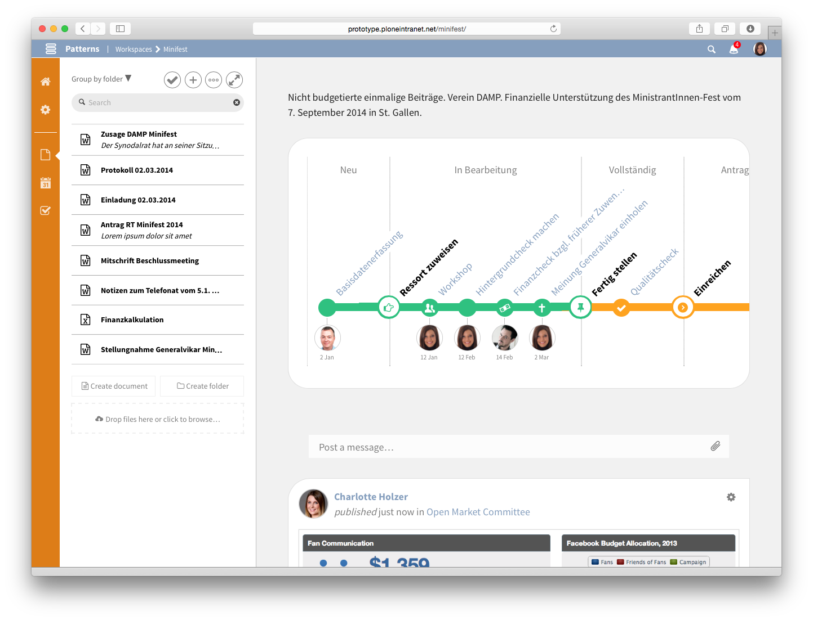
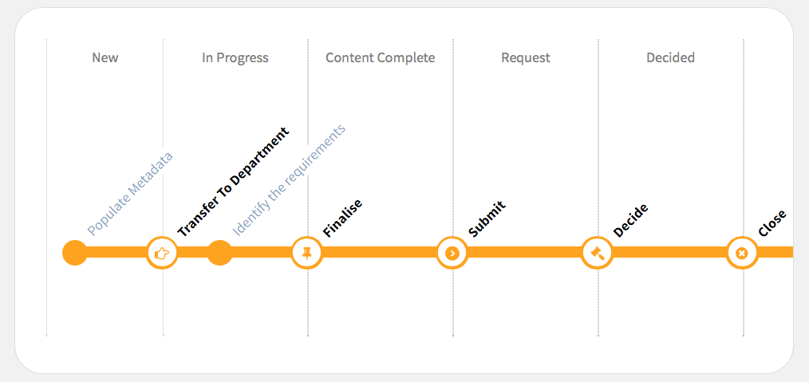

===============
Case Management
===============

.. admonition:: Description

    This package provides a Workspace like content type that brings support for structured and unstructured workflow. By combining tasks with classic state based workflow, it provides a flexible base for Adaptive Case Management.

.. contents:: :local:

Introduction
============

The main distinction between Adaptive Case Management (ACM) and “normal” workflows as used in Business Process Modeling (BPM), is that the traditional BPM paradigm uses workflows to enforce proscribed end-to-end processes, whereas ACM focuses not on constraining the full process, but rather provides “process snippets” which can be recombined by knowledge workers on the fly.

We can conceive of Cases as being composed of Tasks. A Case process is not completely proscribed at the Case level. **Tasks are the core process objects**.

ACM lets knowledge workers assemble and adapt their processes while they're working. The advantage if this is greater flexibility, and lower cost.

User Journey
------------

This section describes a conceptual model for an ACM solution. 

1. A Case is created by selecting the appropriate template from the Case Templates library. The Case Template contains initial Task Templates and has a Workflow definition assigned. 

2. Instantiating the Case from a template sets it up with boilerplate Tasks, which can be assigned to users. Each Task contains a description of an action that needs to be taken. All tasks are initially "open".

3. When all tasks are done, the case manager moves the Case to a new workflow state (changing permissions). This marks the Milestone corresponding with this workflow state as “completed”. It is possible to guard the workflow transition in a way that it can only transition if all tasks are marked done.

Generic framework implementation
--------------------------------

The generic framework consists of Cases, Milestones and Tasks.

* Cases are workflowed. Workflow does not model a complete business process – it's used to map role based access control security.

* The Case workflow is visualised as a linear Metro Map. As workflows can contain circular transitions, only a subset of the workflow can be visualised in a linear way. That is called the "happy flow" and is expected to be the typical process. The system allows to transition one step forward or backward on that line at a time. To know which is the "happy flow", the workflow is configured with a custom variable ``metromap_transitions`` that stores it as a python expression. 

* Each workflow state is called Milestone.

* Cases contain Tasks.

The Workflowing and Eventing subsystems are provided by Plone core. The Generic system comes with a demo "Case Workflow" with example states: new, in progress, content complete, request, decided, closed, archived. Note that providing a custom complex workflow is configuration, not code, so this is already supported by the generic framework out of the box.

The Case Manager App
====================

.. note::

    Coming soon…

Technical Architecture and Implementation
=========================================

The case object inherits from - and assumes to provide all functionality of - a :doc:`workspace`. In addition to that it usually gets a differend DCWorkflow assigned to represent the specific business process that it is meant to implement. 

The Metro Map
-------------

The Metro Map is the main representation of the adaptive case management and is as such a tool to quickly get an overview of the state of the case. The typical path of the workflow is shown as a metro line. The states of the workflow and the tasks in between are displayed as stations. There are two types of stations. 

The slightly larger stations with a white background represent the workflow transitions. They are placed on the border between two worflow states. The workflow states are shown at the top of each section. The station in between is named with the name of the transition that connects both. As the transition stations stem from the workflow which is wired into the system's configuration, these are not changeable through the user interface and typically represent the process that is mandatory.

The smaller stations with a solid colour background (green or orange in the example above) represent the tasks which are assigned to the states. These are flexible and can be assigned and unassigned by the content editors. These tasks are meant to provide the flexibility in completing the work necessary to comply with the mandatory workflow. The tasks are always ordered by deadline - next upcoming first. Afterwards the tasks without deadline are shown. Once a task is completed, it is moved to the left and becomes green.

By colouring the completed states and tasks in green, the Metro Map also serves as a quick status indicator for the completion of the case.

Placeful Workflow
-----------------

A case is assigned a specific workflow through Plone's Placeful Workflow facilities. This workflow is the base for the generation of the Metro Map. A demo workflow is provided, called ``case_workflow``. It is up to the integrator to model the actual business process applicable to the customer and define proper security settings.

.. note::

    A workflow used in a case must provide the ``metromap_transitions`` variable which defines the transitions to show in the happy flow. You can find an example in the provided ``case_workflow`` definition.

.. warning::

   When creating a custom case workflow, take special care to ensure proper security. See notes and example in ``case_workflow/definition.xml`` and test coverage in ``case.robot``.

Because a custom workflow is used, the security settings of the workspace, which are a core feature to simplify security management, are no longer valid and therefore no longer available.

The current implementation of the Metro Map assumes that all tasks must be completed before a milestone can be closed. Therefore the demo workflow has a guard for these transitions that assures all tasks are closed and the user interface disables the "Close Milestone" button otherwise.

Tasks in Cases
--------------

With that workflow and its states in place, tasks are no longer unstructured members of the workspace. Instead they get the ability to be assigned to a state. Therefore also the layout of the tasks sidebar changes and tasks become grouped by states. 

It is still possible to create unassigned tasks. They appear below all groupings under the heading "Unassigned tasks".

As tasks can have deadlines and be assigned to users, this information is displayed prominently on the metro map. 

Templating
----------

In any given organisation there is a high probability that there are many different business processes that can be implemented with a case. To ease creation of cases and reduce the complexity of configuring a case, there is support for case templates. 

On portal creation, the system sets up a workspace container called ``templates`` in the portal root. It adds also a default case in there with the ``case_workflow`` set and some demo tasks. When a user now attempts to create a case, the form provides all cases from that templates folder to select from. 

The selected case is then copied over into the main workspaces container and used as template. All content that is in that case template is copied with it so that it is easy to preconfigure a case with tasks and even documents and events.

.. note::

    Cases in the templates folder are not shown on the main workspace listing. Currently you need to type the path to your case template into the browser manually to access it.

.. note::

   Creating a new case template is not directly supported in the user interface. You can create a new template by opening the following URL in your browser manually: `${PLONE_URL}/templates/++add++ploneintranet.workspace.case`

