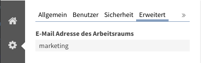

=======
Mail in
=======

.. admonition:: Description

   With MailIn you can send emails directly to workspaces and cases.

.. contents:: :local:

.. note:: This feature allows unencrypted email to be sent to your intranet portal. As email can be forged, this might contradict your security policy. Please make sure to verify any implications carefully.

Concept
-------

This module maps email addresses to workspaces to allow members of the portal to send email directly into the system. For this to work, you need to:

- Configure a dedicated email domain for your intranet (i.e. intranet.yourdomain.com)
- Configure your mailserver to forward all incoming email to a script handler.
- Assign friendly email names to your workspaces (the part before the @).

If you now send an email to such an email address - workspacename@intranet.yourdomain.com - it will be created within the workspace. 

Configure the email address of a workspace
------------------------------------------

- In any workspace, open the settings drawer
- Click the "Advanced" tab
- Enter the name part of the desired email address

Mailserver configuration
------------------------

Mail comes in through a mail server. So when you want mail for mailme@intranet.yourdomain.com to be handled by smtp2zope and sent to your web server, you should add an alias in your smtp server configuration. Something like this probably works (there might be slight differences depending on which mail server you use):

.. code :: 

    mailme@intranet.yourdomain.com "|/path/to/smtp2zope bin/smtp2zope -v -z localhost:8080 -u /Plone/@@mailrouter-inject 1000000"

The number at the end restricts the maximum size of a message; this is optional, but highly recommended.

Invoking the scripthandler manually
-----------------------------------

For testing purposes, you can also invoke the script handler manually. 

To do so, you need a test email as file. 

- Change the From: header to a user that exists in the system. (e.g. yourname@yourdomain.com)
- Change the X-Original-to: header to match the friendly name of your workspace, which you configured above. (e.g. marketing@intranet.yourdomain.com)

.. note:: The system rejects all email coming from email addresses not matching a valid user in the system.

Now you can call the following line from within your zope instance root directory:

.. code:: python

    cat mail.eml | bin/smtp2zope -v -z localhost:8080 -u /Plone/@@mailrouter-inject

Enable/Disable the Feature
--------------------------

- Control panel -> portal_registry -> ploneintranet.mailin.enabled = True

