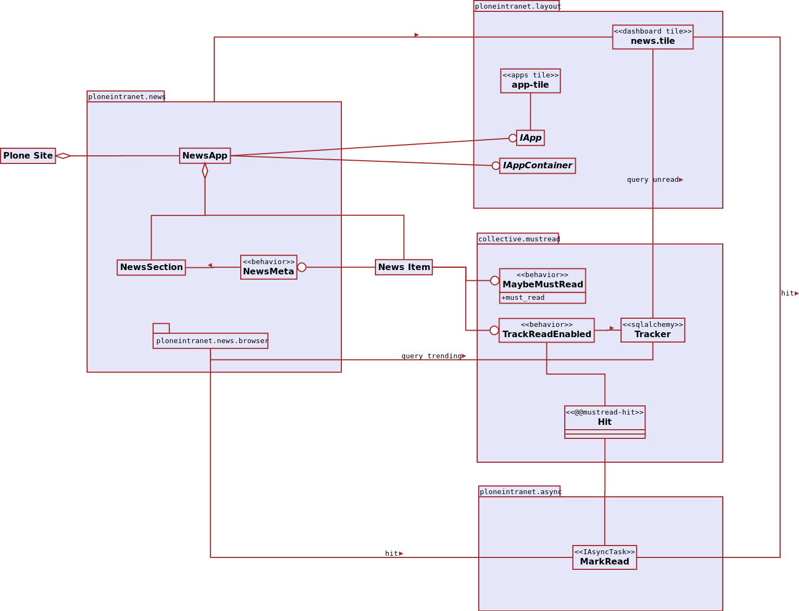

=============
News
=============

.. admonition:: Description

   The news magazine provides a "push comms" channel for company-wide news distribution.

.. contents::
    :depth: 2
    :local:

Configuration
=============

database
--------

.. warning::

   You must configure a database backend for client installs.

Please configure a registry record ``collective.mustread.interfaces.IMustReadSettings.connectionstring``.

It is recommended to make this value identical to the connectionstring used by ``collective.auditlog``.
The mustread implementation takes care to not step on the toes of auditlog, and it will even optimize
by re-using the same database connector if possible.

The default connector for both ``collective.mustread`` and ``collective.auditlog`` is a memory database,
which is obviously unsuitable for production since it gets wiped on process restart.

``ploneintranet.news`` provides an upgrade step to initialize the database. If you don't provide your own
database connection string, it will fall back to a sqlite file store and avoid a in-memory database.

editor access
-------------

Use the Barceloneta admin UI on ``yoursite/news/@@sharing``
to share ``Contributor``, ``Editor`` and ``Reviewer`` access with the
users that ought to manage news items in the *News Publisher App*.

async routing
-------------

Database writes registering each view on a news item are handled asynchronously via a
call to the ``@@mustread-hit`` view on news items. You may want to configure your load
balancer to route requests matching that URL part to a dedicated async worker.

User stories
============

News Publisher App
------------------

- As a news editor, when I visit the ``Apps`` section, I can open the ``News publisher`` app.

- As a news editor, I can use the News publisher to create and edit news sections.
  
- As a news editor, I can use the News publisher to create and edit news items.
  This includes setting the section for the item, setting an image, and various display options.

- As a news editor, I can mark individual news items as "must read" for all employees.

- As a news reviewer, I can use the News publisher to publish news items to the news magazine.

News Magazine
-------------

- As a user, I can visit the ``News`` section and see a beautiful news magazine.

- As a user, when I visit the News magazine I see the most recently published news items.

- As a user, when I visit the News magazine I see the most-read "trending" news items.

- As a user, when I visit the News magazine I can get a news listing per section.

- As a user, when I visit the News magazine I can read the full news item pages.

- As a user, when I access a news item page either via the dashboard or via the magazine, that item disappears from my "must read" listing.
  
- As a news editor, when I visit the News magazine, I can use a special link on each news item to go to the editing page for that news item.

News listing on Dashboard
-------------------------

- As a user, when I visit the dashboard I see a list with the most recent news items, which I can click and read in full.

- As a user, when I visit the dashboard "must read" news items that I have not read yet show up on top of the news listing.

- As a user, when I visit the dashboard I can mark "must read" news items as read, without having to actually visit the news item page.

Architecture
============

Packages
--------

The news functionality is implemented across several packages:

- The main package is ``ploneintranet.news``: this contains the content types, behaviors and browser views for the *News publisher app* and the *News magazine*.

- The dashboard *News tile* lives in ``ploneintranet.layout``. This also shows an *App tile* in the apps listing that links to the *News publisher app*.

- The *must read* and *trending* logic are factored out to `collective.mustread`_ which was created to support the Quaive news functionality.

- The write-intensive user view tracking is routed to ``collective.mustread`` via our ``ploneintranet.async`` :doc:`async`.

.. _collective.mustread: https://pypi.python.org/pypi/collective.mustread

Diagram
-------

Tests
-----

- ``collective.mustread`` has a very extensive test suite on the view tracking backend.

- ``ploneintranet.news`` has some basic smoke tests on behaviors and views.

.. warning::
   
   Robot tests are lacking, because of threading issues with the sqlalchemy ORM in test mode.

Publisher app, magazine and dashboard tile
==========================================

The ``NewsApp`` lives as a singleton in the site root. Because of its multiple roles (it's a portal tab, it's an app, it contains content objects)
this required some tweaking of the ``ploneintranet.layout`` interface contracts:

- The ``NewsApp`` is an ``IApp`` which means it's listed as an app tile in the ``Apps`` section.
  The implementation for app tiles has been refactored make it possible for an ``IApp`` to live
  outside the ``IAppsContainer`` toplevel *Apps* section.

- The ``NewsApp`` is an ``IAppContainer`` (without an 's'!) which means it's a toplevel content container
  which sports its own browser layers that are switched on only for contained content,
  by the :doc:`../frontend/themeswitcher`

The ``NewsApp`` contains all ``News Items`` and ``NewsSection`` objects as direct children, without any nesting.
So ``News Items`` are not contained within ``NewsSection``.

News items are vanilla ``plone.app.contenttypes`` news items, with some additional behaviors applied.
The ``NewsMeta`` behavior on ``News Items``
provides references from the news items to their sections. The implementation of the news publisher enforces
that there always must be at least one news section.

Both the *News Magazine* and the *News Publisher App* are views on the ``NewsApp`` content type that live in ``ploneintranet.news``.

For historical compatibility reasons, the *News Tile* on the dashboard lives in ``ploneintranet.layout.browser.dashboard``.

Must-read and trending
======================

Considerations
--------------

The main design decisions and their driving considerations for the must-read implementation are:

Use a SQL backend
   This much better suits these datastructure for writes, for queries, and for reporting.

   The SQL implementation used is largely copied over from ``collective.auditlog``.
   We're using a different table so that ``collective.mustread`` and ``collective.auditlog`` can co-exist
   within the same database. The *must read* table schema is slightly different. Notably we're using ``userid`` instead of ``username``.

Use pluggable behaviors and a *collective* backend implementation
   There's been some interest in having the backend available as a generic Plone package, outside of Quaive.
   
   By placing all Quaive-specific backend logic in behaviors, it is easy to implement different business logics
   as new behaviors, without having to fork the core database interface this package offers.

Use ``ploneintranet.async``
   Because write-on-every-read is such a big performance risk, we want to not only use a SQL backend but also
   defer all writes to that backend via async. We already have ``ploneintranet.async`` and it was just a few lines
   of code to add an extra Celery task ``MarkRead`` there

Use ploneintranet frontend
   The collective package only provides the backend and does not have a complete frontend implementation.
   The actual frontend integration of our specific user stories is done in ``ploneintranet.*``.
   
   
Call flow
---------

All *News Items* are outfitted with the ``MaybeMustRead`` and ``TrackReadEnabled`` behaviors,
via ``ploneintranet.news:default``.

Every view on a news item, on ``__call__`` fires a Celery task ``MarkRead`` which,
when executed, hits the collective.mustread ``@@mustread-hit`` view on the item.
That view in turn uses the ``TrackReadEnabled`` behavior, which is an adapter of course,
to access the collective.mustread ``Tracker`` utility to mark the news item as
having been read by this user.

A similar call route can be triggered by submitting a subform which is present on each
news item in the dashboard news tile. That form is submitted via AJAX and triggers a
re-rendering of the ``news.tile`` which, on ``__call__``, fires the Celery task etc.
Because the Celery task is async, whereas the tile needs to be re-rendered immediately
in sync mode, the tile keeps a temporary stack of recently submitted *mark read* items
and makes sure those news items don't pop up in the user's news tile anymore, even
before the mustread database has been updated async.

The ``MaybeMustRead`` behavior is super simple and basically only provides an attribute
``must_read`` and a checkbox in the *News Publisher* to toggle that attribute.
If a news item has ``must_read`` set to ``True`` those news items will show up on top
of the news tile on the dashboard, until they are marked read by the user.
This "sticking on top" nagging is the only effect of ``MaybeMustRead``.

The ``TrackReadEnabled`` behavior is active regardless of whether a news item is marked
as *must read*. We're tracking all reads on all news items, so we can calculate which
news items are *trending*. The trending column in the news magazine shows news items
sorted by the number of users that have read those items in the past 14 days, with the
most-read items on top.

All the *mark read* actions are only executed once per user per news item. Subsequent
reads of a news item will not trigger a database write. Consequently, we have
only one database record per user per news item, and the trending count considers only
the first read of a news item per user.

Database
--------

Writes to the database are exclusively routed via the ``ploneintranet.async`` Celery task ``MustRead`` and
the subsequent ``collective.mustread`` call chain as outlined above (view - behavior - tracker).

Reads from the database are queried directly by the *News Tile*, to show only unread items,
and by the *News Magazine* to show *trending* items.
Both these call routes use the ``collective.mustread`` tracker API as documented in ``ITracker``:

https://github.com/collective/collective.mustread/blob/master/src/collective/mustread/interfaces.py
