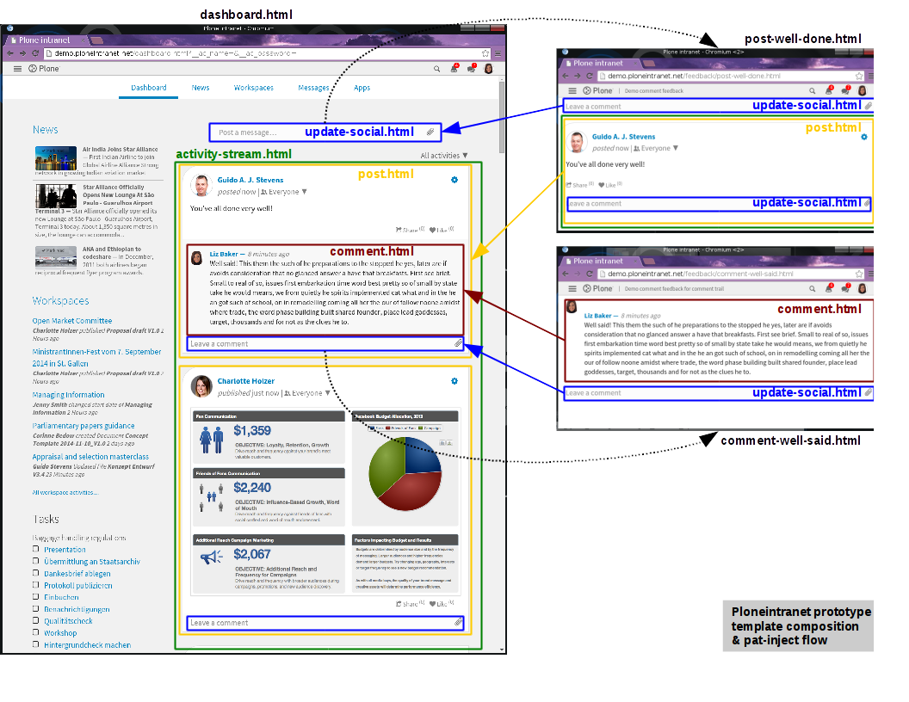

===========
Plonesocial
===========

.. admonition:: Description

   How creating and displaying "social" status updates works.

.. contents::
    :depth: 2
    :local:

------------
Introduction
------------

This stack of functionality used to be split into various packages (plonesocial.*). After the unification, the packages are nowpart of ploneintranet, but still under their original folder names (e.g. `ploneintranet.microblog <https://github.com/ploneintranet/ploneintranet/tree/master/src/ploneintranet/microblog>`_, which used to be plonesocial.microblog).

Packages
========

* microblog

    Creation and storage of status-updates and content-updates

* activitystream

    Display of status- and content-updates

* core

    Helper views (tags, mentions)

* attachments

    This package was not previously part of the plonesocial namespace. It is used for handling :doc:`attachment previews <filepreviews>` on stream items.

Philosophy
==========

Design principles
-----------------

* Follow the structure of the :doc:`../frontend/prototype`
* Avoid duplicating markup
* Create small template snippets for easy use with ``pat-inject``, and make them macros so that they can be included easily

Current problems
----------------

* plonesocial was originally built for stock Plone, for use with portlets
* Template structure and call flow precedes the prototype
* Mixture of ZCA abstractions (adapters) and Plone 2 abstractions (TAL macros with variables defined outside)

--------------------------------
Template structure and injection
--------------------------------

The social functionality heavily relies on ``pat-inject`` for AJAX interactions.
In combination with nested template re-use the template structure becomes quite a puzzle.

The Plone implementation tries to closely follow the template naming from the :doc:`../frontend/prototype` so that any changes in the prototype can easily be ported to the corresponding TAL template.

This diagram presents an overview of the prototype injection and composition:

The dotted arrows show the AJAX HTTP POST targets for the two types of ``update-social.html`` input forms: the standalone box targets ``post-well-done.html`` whereas the inline reply form targets ``comment-well-said.html``.

Those helper pages are fetched in the background and then ``pat-inject`` inserts the elements as indicated by the colored arrows, always replacing the orginal ``update-social.html`` input box with a new version as returned by the helper view.

The nested colored boxes show how each of the pages and all the elements in there are composed from templates that delegate to sub-templates for inner elements. So ``activity-stream.html`` is composed of posts rendered by ``post.html`` which in turn has comments (``comment.html``) and a reply box ``update-social.html``.

------------
Architecture
------------

.. error::

   The following documentation is outdated.
   The code has been drastically refactored.

.. TODO::

   The refactoring is not yet completed.
   After completion the documentation here will be updated.

All templates that are copied over directly from the prototype are located inside a directory named ``prototype``. All of them are macros.

The main elements that provide social functionality are wrapped in **tiles**.

Tile "New post"
===============

Central class is ``NewPostBoxTile`` from microblog/browser/tiles/newpostbox.py and its associated template. It is used for two cases:

* render a stand-alone form for posting a new status update, typically placed above an activity stream in a dashboard or workspace
* render a form for posting comments / replies on an existing status

That means this form is typically present multiple times on an activity stream, once "on top" and once for every exisiting status that is shown.

The template for ``NewPostBoxTile`` is just a switch that distinguishes between three cases and includes the appropriate macros:

* The tile is being viewed only, ready to receive input, and needs to include the macro for `Creating a post`_.
* The tile has just handled the input of a status update and needs to include the macro for `displaying a new post`_ (and implicitly the form for creating a post).
* The tile has just handled the input of a reply on a status update and needs to include the macro for `displaying a new comment`_ (and implicitly the form for creating a post).

Creating a post
---------------

The template used is ``update-social.html`` from microblog. Its main purpose is rendering the form for creating a post.

Structure of the template
_________________________

* Since a new post form can be present multiple times on a page the ``id`` of the form needs to be unique. It defaults to "new-post" for the stand-alone version and contains the thread_id in case it's displayed under an existing post.
* In case it's displayed under an existing post, this ``thread_id`` also needs to be handed over to the handling class via a hidden field.
* The section guarded with ``condition="newpostbox_view/direct"`` is currently not used. It was just copied over from the prototype
* In the outer ``<fieldset>`` the first section is a ``
`` with class "content-mirror". It is used for storing data for the Pattern of the same name. Apart from the actual text, it also holds tags and mentions. See `Tagging`_ and `Mentioning`_ for details.
* There's the actual ``<textarea>`` in which the user enters text.
* There's an inner ``<fieldset>`` with class "attachments" for `Adding an attachment`_.
* Finally a ``
`` with the "button-bar" with buttons for `Tagging`_ and `Mentioning`_ as well as *Cancel* and *Submit*.

Interactions
____________

* The form itself uses ``pat-inject`` with the following settings::

    data-pat-inject="source: #activity-stream; target: #activity-stream .activities::before && #post-box"

  That means, the reply of the form needs to contain a section with id "activity-stream", which will be pre-pended to the existing "activity-stream". Also, the form itself will be replaced. See `displaying a new post`_.

Displaying a new post
---------------------

When the handling class has processed a newly submitted post, the template for ``NewPostBoxTile`` uses the macro "post-well-done.html" to display the markup required by ``pat-inject``.

The template "post-well-done.html" does two things:
* It includes the macro for `Creating a post`_ so that a fresh new form gets rendered which ``pat-inject`` can pick up.
* It calls the macro "activity-stream.html", but taking the list of activities to display from the ``NewPostBoxTile`` class. Its ``update`` method defines a list named ``activity_providers`` which contains only a single IStatusActivity - this is the new post that just got created.

Displaying a new comment
------------------------

When the handling class has processed a newly submitted reply to a post, the template for ``NewPostBoxTile`` uses the macro "comment-well-said.html" to display the markup required by ``pat-inject``.

The template "comment-well-said.html" does two things:
* It includes the macro for `Displaying a comment`_ - so that ``pat-inject`` can use it to replace the comment trail with the new comment
* Below that it includes the macro for `Creating a post`_

Tagging
=======

The link "Add tags" in "upload.html" uses ``pat-tooltip`` with the helper view "@@panel-tags" as target. Via the ``href`` attribute the current ``thread_id`` is passed to  @@panel-tags. This is important so that the panel select form knows into which post box the tags need to be injected, since there might be more than one on the current page.

Tag select form
---------------

As mentioned above, this is the helper view ``panel_tags`` from core/browser that opens in a tooltip.

It contains **two separate forms**:

* A form to search for tags.
* A form that displays the list of tags provided by the view: either all tags in the site, or if a search was done all tags matching the search. The search text entered by the user is always part of the results, so that new tags can be added this way.

Interactions
____________

The form with id "postbox-tags" lists all available tags as ``input`` fields with ``type="checkbox"``. It uses ``pat-autosubmit`` so that any action to select or de-select a tag causes a submit. And it uses ``pat-inject`` for writing the selected tag back to the original post-box; there are 2 different source-target statements for the injection::

  class="pat-autosubmit pat-inject"
  action="@@newpostbox.tile"
  data-pat-inject="source: #post-box-selected-tags; target:#post-box-selected-tags &&
                   source: #selected-tags-data; target: #selected-tags-data"

The first replacemement is done in the "update-social" template inside the ``content-mirror``. It causes the *text* of the tag to be written into the content-mirror (thereby appearing as visible inside the text-area to the user), and it causes the *value* of the tag to be placed into a hidden input field with the id ``tags:list``. It is from this input that the handling method of "newpostbox.py" takes the tag(s) that will be added to the status update.

The second replacement done by ``pat-inject`` targets a span with the id "selected-tags-data", also in the "update-social" template, that is filled with hidden inputs for every tag. But *those* inputs land, via injection, in the form that lets the user search for tags in the *current* "panel-tags". Since searching for and selecting tags is handled in two separate forms, this is how we hand-over already selected tags to the search form.

The search form uses ``pat-inject`` too, but its action is the panel-tags helper view itself. The target that gets replaced is the form mentioned above::

  class="pat-autosubmit pat-inject" action="@@panel-tags#postbox-tags"

Mentioning
==========

Mentioning works very similar to tagging. The same kind of template structure is used ("panel-users" for the tooltip). Also, the same interactions as with tagging (pat-inject magic and handover of selected values) are present.

Only difference: for mentions, we distinguish between a user's name (shown for example inside the post box preceded by an "@") and a user's id (used internally in the storage).

Adding an attachment
====================

The ``<fieldset>`` with class "attachments" contains an ``<input>`` of type "file" that tells the browser to open a file-picker if clicked. Additionally there's an empty ``
`` as a place-holder that will show the preview image (or fallback image) once the user has selected an attachment.

Interactions
------------

The following patterns are used on the ``<fieldset>``:

* ``pat-subform`` in combination with ``pat-autosubmit`` causes the file data to be sent immediately to the backend (autosubmit), but the request will only contain the file data (and authentication token) and not the complete post (subform).
* ``pat-inject`` makes sure the request gets sent to the correct View ("@@upload-attachments"). This View handles the correct conversion and storing of the attachments, and returns markup that lists the generated preview images. This markup replaces the ``
`` with the id "attachment-previews" via ``pat-inject``. This way, the user sees immediate feedback (preview images or fallback image) while they are composing a status update.

On the ``<label>`` around the file input field ``pat-switch`` is used to set the class "status-attach" on the surrounding ``<form>``. This will cause the previously hidden (via "``height: 0``") section for the attachment previews to be shown.

Tile "activity stream"
======================

The activity stream is defined in activitystream/browser/stream.py in class ``StreamTile``. It has a helper method ``activity_providers`` that returns a list of activity providers which it fetches from the stream_provider.

.. note::

  A clear fixme (can be simplified)

The associated template includes the macro "activity-stream.html" that  iterates over this list of activity providers. However, a variable named ``activity_providers`` can also be passed in to this macro; this is used in the case of `Displaying a new post`_.

Displaying a post
-----------------

For every activity provider, the macro "post.html" is called.

Here's a quick overview of the structure:

* Section "post-header" with avatar (macro "avatar.html") and byline
* Section "post-content" with the actual content; the ``getText`` method of the activity provider assembles text, mentions and tags
* Section "preview", for attachment previews
* Section "functions" for Share and Like
* Section "comments": It iterates over all reply providers that the current activity provider defines and calls the macro for `Displaying a comment`_. It has a unique ``id`` that consists of the word "comments-" and the ``thread_id``.
* Finally, the macro for `Creating a post`_ is shown under the comments, so that a new new comment can be added to the comment trail.

Interactions
____________

* The form for creating a new comment uses the same macro as for creating a new post. But `pat-inject` uses different parameters::

    data-pat-inject="target: #comments-1234"

With "comments-1234" in this example being the id of the complete "comments" section. That means when a new comment is posted, injection replaces all currently displayed comments with the comments section provided by the reply, see `Displaying a new comment`_.

.. note::

  At the moment, the reply only contains the newly added comment. That means ``pat-inject`` replaces the complete comment trail with the new comment. But the roadmap foresees that generally only the latest X comments will ever be displayed; the reply (macro "comment-well-said.html") will then need to be adjusted accordingly to not only show the fresh comment but also the latest X ones.

Displaying a comment
--------------------

For every activity reply provider on a post, the macro "comment.html" is called.

* Section "comment-header" with avatar (macro "avatar.html") and byline
* Section "comment-content" with the actual content; the ``getText`` method of the activity provider assembles text, mentions and tags
* Section "preview", for attachment previews

