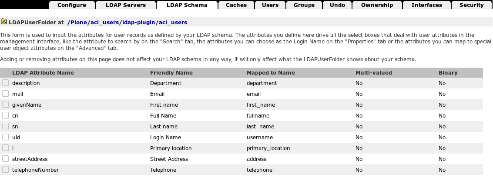

=============
User Profiles
=============

Plone Intranet is designed to provide an out-of-the-box user profile which provides the following:

 * Authentication (using dexterity.membrane_)

 * Customisable profile fields (using dexterity behaviours which can be disabled or overriden)

 * Support for external data sources (e.g. AD/LDAP)

The following key design decisions were made to fit the use cases of Plone Intranet:

 * **Users as content**

   Rather than using default plone members, we use dexterity.membrane_ to create real dexterity content that can be managed in the same way as all other content, whilst still providing authentication.

 * **Username as Userid**

   The default membrane implementation uses UUIDs as the unique id that Plone uses to grant roles and permissions (userid). We use the username instead, to ensure compatibility with external authentication sources such as AD/LDAP which have no knowledge of Plone's UUIDs.

   This means that userprofile.username is and always should be equal to the userid userprofile.getId(). Neither should ever be changed. Profiles should never get a new content id, this is not supported and will trigger bugs. Note that ``getUserName()`` will return a value different from ``.username`` in case logging in by email is enabled. See 'Login by email' below and developer notes further down.

   The default membrane implementation uses email addresses as login names. We default to using the userid as stored in the username field, as login name. It is possible to configure your site to do login-by-email, see below.

.. _dexterity.membrane: https://pypi.python.org/pypi/dexterity.membrane/

User Management
===============

You should not use the Zope rescue user for anything else, than creating users as documented here.

.. warning::

   You should not create users via the Plone control panel.
   Also, directly creating user profiles in Barceloneta is invalid -
   this will appear to work but it *will* trigger bugs,
   like not being able to add such profiles as members to workspaces.

Use an external data source (Active Directory / LDAP) to manage your users, see below.
Or use the bulk upload facility to create user profiles, as documented below.

Bulk Upload
-----------

There is a bulk upload from CSV option. Column names are mapped to field names, and the data is validated before users are created:

To use the bulk upload, visit the `@@import-users` browser view on the profiles folder in your site:

.. code::

   /plonesite/profiles/@@import-users

See :download:`this example csv file <users.csv>` to get you started.
Supported columns are listed in the `@@import-users` view.

If you check "Update details for existing users" existing user profiles are updated with the values provided in the csv file.

If you omit values in the password column, a password is auto-generated for new users, and the password of existing users will be kept.

.. warning::

   Don't upload the example CSV into a production site without changing at least the passwords...

Role assignments
----------------

After creating users with bulk upload, you can manage role assignments
in the Plone control panel by using the :doc:`../frontend/themeswitcher`

.. code::

   http://cms.localhost:8080/Plone/@@usergroup-userprefs

Please do not add users in this control panel, it won't work.

If you're using AD/LDAP to manage users, you may want to manage roles and groups via LDAP instead. YMMV.

Avatar images
-------------

After creating users with bulk upload, you can add avatar images as follows:

- In the siteroot, via the Barceloneta interface on cms.localhost:8080, add a Folder 'avatars' to the portal root

- Upload images into this folder with ids like 'johndoe.jpg' matching userid 'johndoe'

  (As plone does not allow ids containing dots, use 'john_doe.jpg' as avatar image for userid 'john.doe')

- Run ``http://portal_url/avatars/@@import-avatars``

Login by email
==============

By default, the userid is the username is the login name.

If you'd like to provide users with a different login name, the only supported option is to enable logging in by email address. Any change to the ``email`` attribute on a userprofile, will then result in a different login name for the user on the login page. To enable login by email, change the following dexterity.membrane registry setting in ``registry.xml`` from the ploneintranet default ``False`` to ``True``:

.. code-block:: xml

  <record name="dexterity.membrane.behavior.settings.IDexterityMembraneSettings.use_email_as_username">
    <value>True</value>
  </record>

If you're changing this in an existing site, you then need to either reindex the ``exact_getUserName`` and ``getUserName`` indexes in ``membrane_tool``.

.. warning::

   In addition to the dexterity ``use_email_as_username`` setting, there's a plone setting ``use_email_as_login`` as well. You should not touch this when using LDAP: it has an event handler which is not LDAP aware and will error out trying to update non-existant ZODB acl_users.

Our login and password page overrides retrieve the dexterity setting, not the plone setting to determine whether logging in by email is enabled. This will result in some textual adjustments on those pages.

External authentication and/or data sources (e.g. AD/LDAP)
==========================================================

The Plone Intranet UI always uses the membrane profile data as the source of
user data, to ensure a consistent experience when assigning roles, searching
or browsing users.

However there are various features in place to support external
authentication and user data sources.

For instructions on installing LDAP, see :doc:`../../../installation/ldap`

Automatic profile creation
--------------------------

If a user authenticates to the site using an alternative authentication system,
the login event triggers the automatic creation of a matching membrane profile.

Manual profile creation
-----------------------

The `sync-users` browser view is available on the `profiles` directory,
and can be used to synchronise the profiles on the site with a list of
users provided by an external data source such as AD/LDAP.

To use this view, first load the `Plone Intranet : Suite : LDAP` profile
in the ZMI in generic_setup.

This registers the ID of a PAS plugin as your main user
source using the `ploneintranet.userprofile.primary_external_user_source`
registry entry:

.. code-block:: xml

  <record name="ploneintranet.userprofile.primary_external_user_source">
    <field type="plone.registry.field.ASCIILine">
      <title>Primary External User Source</title>
      <description>
        The ID of the PAS plugin that will be treated as the primary source of external users.
      </description>
    </field>
    <value>ldap-plugin</value>
  </record>

This PAS plugin will be used as the canonical set of user accounts that
are supported on the site. Running the `sync-users` view will:

* Add missing membrane profiles for any users found in the primary PAS plugin
* Disable existing membrane profiles for any users missing
  from the primary PAS plugin.

This view is designed to be run periodically using a clock server
or cron task.

The view requires Manager privileges.

.. code::

   /plonesite/profiles/@@sync-users

Property sheet mapping
----------------------

It is also possible to configure specific membrane properties to be
regularly synchronised with an external data source (such as AD/LDAP) using
Plone's PAS properties infrastructure.

The registry entry `ploneintranet.userprofile.property_sheet_mapping` allows each user profile field to be mapped to a specific PAS plugin (using the id of the PAS plugin inside acl_users):

.. code-block:: xml

  <record name="ploneintranet.userprofile.property_sheet_mapping">
    <field type="plone.registry.field.Dict">
      <title>Property sheet mapping</title>
      <description>
        A mapping of a user property to a specific property sheet which
	should be used to obtain the data for this attribute.
      </description>
      <key_type type="plone.registry.field.ASCII" />
      <value_type type="plone.registry.field.TextLine" />
    </field>
    <value>
      <element key="username">ldap_plugin</element>
      <element key="email">another_pas_plugin</element>
    </value>
  </record>

External property synchronisation
---------------------------------

The `sync-user-properties` browser view is available on the `profiles` directory,
and will use the above mapping to copy the relevant properties from the
relevant PAS plugin property sheet, and store it on the membrane profile.

It supports *any* PAS plugin that provides PAS properties for a user,
and will update *all* existing membrane profiles every sync,
so could be expensive depending on the number of users in your site.

This view is designed to be run periodically using a clock server
or cron task.

The view requires Manager privileges.

.. code::

   /plonesite/profiles/@@sync-user-properties

You can also sync an individual user profile using the `sync` view.
This view also requires Manager privileges.

.. code::

   /plonesite/profiles/joe-bloggs/@@sync

Specific AD/LDAP synchronisation
--------------------------------

If you have plone.app.ldap_ installed, a separate AD/LDAP view is provided
that will query the AD server for any users that have changed since the
last sync (using the `whenChanged` AD attribute).

This significantly improves the performance of the sync:

.. code::

   /plonesite/profiles/@@sync-user-properties-ldap

.. _docs.plone.org: http://docs.plone.org/external/plone.app.dexterity/docs/advanced/behaviours.html

.. _Behaviours: http://docs.plone.org/external/plone.app.dexterity/docs/behaviors/index.html

.. _plone.app.ldap: https://pypi.python.org/pypi/plone.app.ldap

Customising User Profiles
=========================

User profiles are expected to be highly customised for each Plone Intranet deployment. As such, the profile views are built dynamically from dexterity behaviours, and support extra options such as hidden or read-only fields.

Vocabularies
------------

The following vocabularies can be customised
using their corresponding plone.app.registry_ entries
(e.g. using GenericSetup).

 * **Primary Location** : ploneintranet.userprofile.locations

.. _plone.app.registry: https://pypi.python.org/pypi/plone.app.registry

Adding/Removing fields
----------------------

The User Profile comes with a base set of fields that are required by the Plone Intranet templates. These fields are as follows:

.. autointerface:: ploneintranet.userprofile.content.userprofile.IUserProfile
   :members:

There is also an additional set of (optional) fields. The optional fields are provided by the behaviour :class:`IUserProfileAdditional <ploneintranet.userprofile.content.userprofile.IUserProfileAdditional>`

You can remove the optional fields by disabling the `IUserProfileAdditional` behaviour in your GenericSetup profile. For more information on adding/removing behaviours using GenericSetup, see docs.plone.org_.

To add new fields, simply create a new behaviour and assign it to the ploneintranet.userprofile.userprofile type. For more information on adding custom field behaviours, see the Behaviours_ manual.

Hiding fields
-------------

To hide fields from the UI, add the relevant field name to the `ploneintranet.userprofile.hidden_fields` registry entry using GenericSetup:

.. code-block:: xml

  <record name="ploneintranet.userprofile.hidden_fields">
    <field type="plone.registry.field.Tuple">
      <title>Hidden fields</title>
      <description>
        User profile fields that are hidden from the profile editing page
      </description>
      <value_type type="plone.registry.field.TextLine" />
    </field>
    <value>
      <element>first_name</element>
      <element>MyCustomBehaviour.my-hidden-fieldname</element>
    </value>
  </record>

Read-only fields
----------------

To mark a field as 'read only' in the UI (but leave the field editable via code), add the relevant field name to the `ploneintranet.userprofile.read_only_fields` registry entry using GenericSetup.

This is useful for field data that comes from a separate source (e.g. AD/LDAP)

.. code-block:: xml

  <record name="ploneintranet.userprofile.read_only_fields">
    <field type="plone.registry.field.Tuple">
      <title>Read only fields</title>
      <description>
        User profile fields that are read-only
        (shown on profile editing page but not editable)
      </description>
      <value_type type="plone.registry.field.TextLine" />
    </field>
    <value>
      <element>username</element>
      <element>MyCustomBehaviour.my-read-only-fieldname</element>

    </value>
  </record>

LDAP: Putting it all together
=============================

Plugin activation
-----------------

- ZMI Install portal_setup > import > Plone Intranet Suite: LDAP

- ZMI http://localhost:8080/Plone/acl_users/ldap-plugin/acl_users/manage_servers
  Delete the existing ldap server and create a new one with the right hostname and port. For a default ploneintranet buildout that is: host ‘localhost’ and port ‘8389’.

- ZMI http://localhost:8080/Plone/acl_users/ldap-plugin/acl_users/manage_main
  Configure the ``User Base DN``, ``Group Base DN``,  ``Manager DN`` and
  ``User password encryption`` to match your local LDAP installation.

If you'd like to configure that directly in ``ldap_plugin.xml`` be aware that it'll
by default be configured ``update="False"`` which means you'd have to *delete* the LDAP plugin before loading the settings would take effect.

Attribute mapping
-----------------

The variable names used in Plone may be different from the attribute names
in your LDAP schema. ``plone.app.ldap`` maintains a mapping of the "LDAP key" to
"Plone key" which you can inspect in the ZMI under "LDAP Schema"
(direct ZMI URL: http://localhost:8080/Plone/acl_users/ldap-plugin/acl_users/manage_ldapschema )

The default mapping looks like this:

You can change this mapping in GenericSetup by changing ``ldap_plugin.xml``.
(ZMI portal_setup: ``plone.app.ldap.ploneldap.exportimport.exportLDAPSettings``).

But even if you don't need to change it you'll need to be aware of this name
mapping in order to understand how the registry configuration below interacts
with your LDAP schema.

registry.xml
------------

To use LDAP, you will typically need to add the following registry config
to your own policy GenericSetup. The below reflects the default ``plone.app.ldap``
setup - you may wish to remove or change certain fields, depending on your
own LDAP schema.

.. code-block:: xml

    <?xml version="1.0"?>
    <registry xmlns:i18n="http://xml.zope.org/namespaces/i18n"
              i18n:domain="ploneintranet">
        <record name="ploneintranet.userprofile.primary_external_user_source">
        <field type="plone.registry.field.ASCIILine">
          <title>Primary External User Source</title>
          <description>
            The ID of the PAS plugin that will be treated as the primary source of external users.
          </description>
        </field>
        <value>ldap-plugin</value>
      </record>
      <record name="ploneintranet.userprofile.property_sheet_mapping">
        <field type="plone.registry.field.Dict">
          <title>Property sheet mapping</title>
          <description>
            A mapping of a user property to a specific property sheet which
            should be used to obtain the data for this attribute.
          </description>
          <key_type type="plone.registry.field.ASCII" />
          <value_type type="plone.registry.field.TextLine" />
        </field>
        <value>
          <element key="username">ldap-plugin</element>
          <element key="first_name">ldap-plugin</element>
          <element key="last_name">ldap-plugin</element>
          <element key="email">ldap-plugin</element>
          <element key="department">ldap-plugin</element>
          <element key="telephone">ldap-plugin</element>
          <element key="address">ldap-plugin</element>
          <element key="primary_location">ldap-plugin</element>
        </value>
      </record>
      <record name="ploneintranet.userprofile.read_only_fields">
        <field type="plone.registry.field.Tuple">
          <title>Read only fields</title>
          <description>
            User profile fields that are read-only
            (shown on profile editing page but not editable)
          </description>
          <value_type type="plone.registry.field.TextLine" />
        </field>
        <value>
          <element>username</element>
          <element>first_name</element>
          <element>last_name</element>
          <element>email</element>
          <element>IUserProfileAdditional.department</element>
          <element>IUserProfileAdditional.telephone</element>
          <element>IUserProfileAdditional.address</element>
          <element>IUserProfileAdditional.primary_location</element>
        </value>
      </record>
    </registry>

There's a gotcha: ``fullname`` is a calculated property, so don't try to set that directly.

User identifier versus login name, oh my
========================================

TL;DR:  Of all the possible user-identifierish attributes and accessors: use ``getId()`` by default. Unless you need an actual login name for authentication, in which case you should use ``.getUserName()``.

The problem: for our membrane userprofiles ``id == getId() == getUserId() == username == getUserName()`` except when logging in by email, in which case: ``id == getId() == getUserId() == username != getUserName() == email``. Non-membrane acl_users like admin and test users behave differently again.

In Plone, semantically the username is the login name the user inputs in the login form. The userid is a stable user identifier the code uses to refer to a user object.

If you set ``dexterity.membrane.settings.IDexterityMembraneSettings.use_email_as_username`` to True, then it becomes possible for users to change email addresses, hence login names as returned by ``getUserName()`` - and in this scenario you want to keep the userid unchanges so you retain user profile history. Note that in this scenario ``getUserName()`` will be different from ``username`` which must remain equal to ``userid``.

The confusion between username and userid is endemic throughout the Plone stack, including the ploneintranet code base. In many many instances ``username`` syntax is use for what semantically is a ``userid``. It's impossible to search-and-replace that, since the upstream API's of e.g. dexterity.membrane and plone.api already hardcode the mistake.

To make this even more of a mission impossible, much of our code and test code mixes membrane user profiles with addressing acl_users members. Which are different beasts, with different APIs, even though they're facets of the same actual user profile object.

As a solution I offer you the following meditation on syntax versus semantics:

- A ``userprofile.id`` is the content object's id in the userprofiles folder. This will be the same as the userid - see ``ploneintranet.api.userprofile.create``, and the assumption that the two are identical plays out in our code base. Changing content ids of userprofiles later on is not possible, see the tests in ``ploneintranet.userprofile`` that try to do that.

- A ``userprofile`` does not have a ``userid`` attribute. The dx.membrane behaviors do provide ``.getId()`` and ``.getUserId()`` accessors. These are identical.

- A ``userprofile`` has a ``.username`` attribute. The value of this will be identical to the user id, since this is what ``ploneintranet.api.userprofile.create`` does on creating the profile. DO NOT CHANGE THE USERNAME. This attribute is used as an alias for userid throughout our code base, never mind that the name does not match the meaning. Changing the username invites disaster.

- A user profile also has an ``email`` attribute. Here it gets interesting. If you enable ``use_email_as_username``, the actual login name is the email address as returned by ``getUserName()`` - which is only available on a behavior, not directly on a userprofile. And this may, for some users, be an updated email address different from the ``username`` they were created with.

- A acl_users member is a different thing again. It has a ``getUserName()`` accessor, and sometimes it has a working ``getUserId()`` accessor (when it's backed by a membrane user) and sometimes it doesn't (e.g. admin acl_user). It always has a ``getId()`` accessor and that's what we're using.

Further reading:

- https://github.com/collective/dexterity.membrane/pull/27

- ploneintranet/src/ploneintranet/userprofile/tests/test_username_userid.py

Dos and donts
-------------

- When working with authentication code, use ``getUserName()`` instead of ``username`` to get the actual login name, as opposed to the user identifier.

- In all other code paths, user references typically are user ids. For clarity, it's best to use ``getId()``, which is safer than ``getUserId()`` but for legacy compatibility ``username`` is also fine, because that should always match the userid. Just remember that ``username`` syntax is userid semantics, not the login name.

- Never use ``getUserName()`` syntax for userid semantics. It will appear to work, until you toggle ``use_email_as_username`` and then you're in a world of pain, where only those users whose email address is different from their user id suffer obscure bugs.

User Profile API
================

.. automodule:: ploneintranet.api.userprofile
    :members:
    :undoc-members:
    :show-inheritance:
