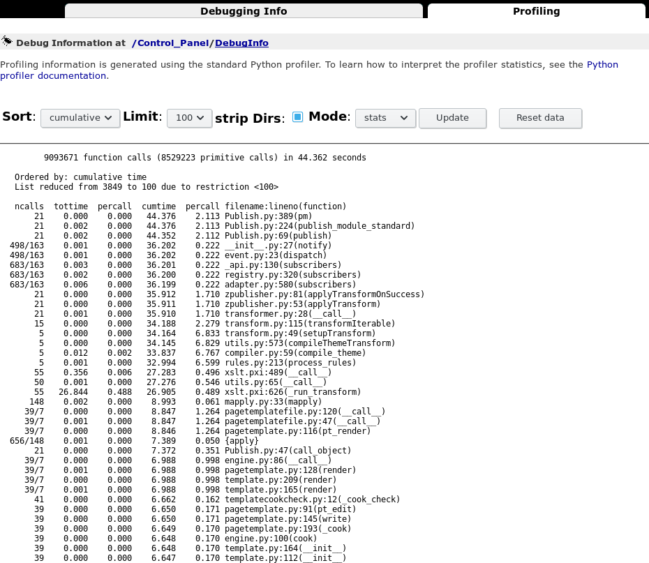

==========================
Debugging tools and tricks
==========================

Celery
======

Celery logging level
--------------------

Launch celery in INFO log level::

    $ bin/pcelery worker parts/instance/etc/zope.conf -l info

Debugging in Celery tasks
-------------------------

PDB cannot be used in Celery (it would raise a BdbQuit exception and die).

We can use rdb instead::

    from celery.contrib import rdb
    rdb.set_trace()

It will stop the task execution with a message like::

    [2015-03-04 11:16:11,951: WARNING/Worker-2] Remote Debugger:6901: Please telnet into 127.0.0.1 6901.
    Type `exit` in session to continue.
    Remote Debugger:6901: Waiting for client...

We have to open a telnet session on the mentionned port to access the debugger::

    $ telnet localhost 6901

See also *debugging tests* in the async documentation: :doc:`./components/async`

Zope profiler
=============

The ZMI contains a built-in performance profiler under ControlPanel / Debug Information.

Activating the profiler
-----------------------

To activate, add the following to your buildout.cfg::

    [instance]
    environment-vars +=
        PROFILE_PUBLISHER 1

    zope-conf-additional +=
        publisher-profile-file ${buildout:directory}/var/profile.dat

Monkey required
---------------

If you try to access the debug information in the ZMI, this will break on::
        
  Module App.ApplicationManager, line 171, in refcount
  Module celery.five, line 314, in __getattr__
  AttributeError: 'log' object has no attribute '__file__'

You can fix that by applying the following patch to class ``DebugManager`` in ``ApplicationManager.py``::

    *** /var/tmp/eggs/Zope2-2.13.24-py2.7.egg/App/ApplicationManager.py~	2016-04-08 10:22:03.818536674 +0200
    --- /var/tmp/eggs/Zope2-2.13.24-py2.7.egg/App/ApplicationManager.py	2016-12-28 15:37:22.948853573 +0100
    ***************
    *** 168,174 ****
                  if 'six.' in m.__name__:
                      continue
                  for sym in dir(m):
    !                 ob = getattr(m, sym)
                      if type(ob) in t:
                          counts[ob] = sys.getrefcount(ob)
              pairs = []
    --- 168,177 ----
                  if 'six.' in m.__name__:
                      continue
                  for sym in dir(m):
    !                 try:
    !                     ob = getattr(m, sym)
    !                 except AttributeError:
    !                     continue
                      if type(ob) in t:
                          counts[ob] = sys.getrefcount(ob)
              pairs = []

Using the profiler
------------------

One way of using the profiler is to sort by cumulative time, then see if there are any suspicious time jumps at a specific call point. Typically you hit the site once after startup to warm all caches, then ``Reset data``, then hit the site again to obtain call stats for a hit with warm caches.

In the profiler output below for example it is immediately obvious the Diazo transforms are not cached and eat an inordinate amount of CPU time.

