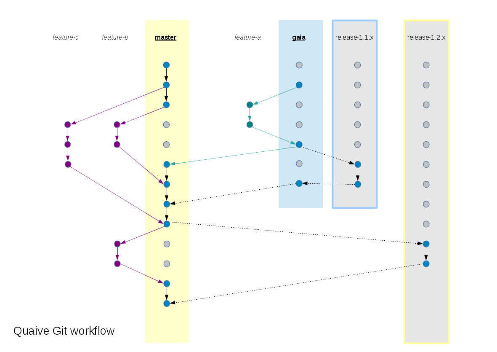

============
Git workflow
============

All our code is on Github, and we use a "normal" Github workflow: create a branch, do some work, issue a pull request, work gets merged.
See :ref:`dod` for what makes a good pull request.

Benefits:

- Working on a feature branch provides isolation while you're working on the feature

- Pull requests are automatically tested and manually reviewed

- The `master` branch is a series of pull request merges and never has test failures

If you're a community contributor working in the public `ploneintranet/ploneintranet <https://github.com/ploneintranet/ploneintranet>`_ repository that's all there is to it.

If you're a core Quaive developer you'll be working in our private `quaive/ploneintranet <https://github.com/quaive/ploneintranet>`_ repository though and
that's where it becomes more complex, because we're simultaneously maintaining multiple releases.

Overview
========

This image summarizes our git workflow:

The "normal" Github workflow remains in place, but the branches you're using differ depending on the release you're targeting.

Basically, for every release target milestone there's a development branch (`master` c.q. `gaia`) and a corresponding release branch
(`release-1.2.x` for Mars, `release-1.1.x` for Gaia).

As a developer, you're never interacting with release branches, only with the development branches and your own feature branch.
         
Mars
====

At the time of writing, Mars is our ongoing Enterprise Edition release target. This is the default if you're doing Quaive development.
The workflow is straightforward: you create a feature branch off `master`, do some work, issue a pull request (against master obviously).

As a developer, that's where it ends for you. Your pull request gets merged and the feature branch is deleted. Your work lives on in `master`.

.. note:: In the diagram, the default Mars developer workflow is illustrated with purple arrows: the `feature-c` and `feature-b` features branching off `master`, and then getting merged into `master`.

From time to time, the release manager cuts a release. The release branch for the Mars cycle is `release-1.2.x`.
This release branch is behind master: it reflects the last release. The release manager prepares a new release
on the release branch. This involves commits changing the version number and change log. These commits are then
put into a pull request from `release-1.2.x` into `master`. The release branch is not deleted but kept for the next release.

See the documentation on :doc:`releasing` for more info.

Gaia
====

At the time of writing, Gaia is our planned Community Edition release, but it has not been released yet.
Any change to Gaia will also end up in Mars - so Gaia is not a fork but a subset of the Mars feature set.

If you're fixing a bug that should go into Gaia (or adding documentation for Gaia, like I'm doing now),
the workflow is as follows:

.. warning:: When working on Gaia, use `gaia` as the base mainline to branch from, and merge into.

- Create a feature branch off `gaia` instead of `master`. Think of `gaia` as "old master".

- Do some work on the feature branch.

- Issue a pull request against `gaia`. Please take care to not issue a PR against `master` which is the default that the Github UI offers you. Instead, scroll down and select `gaia` as your merge target.

- The `gaia` pull request gets merged.

- Issue *another pull request*, either from `gaia` to `master` or by creating a new branch off `master` and cherry-picking your fixes into that branch.
  This will contain the exact same commits for your fix with the same commit ids. Please do not
  amend or otherwise change those commits. If you need different changes for `master`, create a feature branch with those changes
  on top of the original commits and issue a pull request for the combination. Preserving your original `gaia` commits unchanged
  ensures that we can periodically merge `gaia` into `master` without merge conflicts.

- The `master` pull request gets merged.

As a developer you're ready now.

.. note:: In the diagram, the Gaia developer workflow is illustrated with green arrows: the `feature-a` branch off `gaia`, that then gets merged into `gaia`,
          and subsequently there's a merge from `gaia` to `master`. The dotted lines indicate release manager actions.

The release manager periodically cuts Gaia releases on the corresponding release branch: `release-1.1.x`.
Here again the changes during the release end up in a pull request against `gaia`.
Additionally those changes are then, via a second pull request, merged into `master` to make sure that `master` remains
a superset of `gaia`.

.. note:: Please take care to avoid introducing regressions on `master` when merging from `gaia`. If necessary,
          use `git merge -Xtheirs master` on your feature branch first before issuing a PR against master - i.e.
          merge master into your feature branch with a preference to keep the master code changes. Obviously you'll
          have to check the validity of your branch after doing that.

Venus
=====

At the time of writing, Venus is the current Community Edition.
As a developer, you'd normally not do any changes in Venus.

Managing the community edition release is out of scope for this documentation.
In addition to syncing source code between the two Github organisations, this also involves publishing and testing documented builds.
For Venus that build is in a `venus` branch on ploneintranet/ploneintranet.
For Gaia the community build is being prepared in a separate repository that's currently in `quaive/gaia <https://github.com/quaive/gaia>`_.
