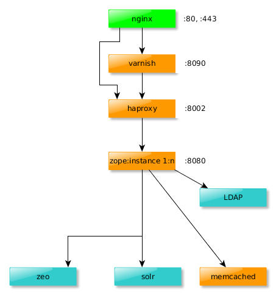

==========
Production
==========

.. admonition:: Description

    This document describes additional components that are typically used in a production deployment

Components
----------

In addition to Zope and ZEO, several other components are typically part of a production deployment. The following diagram shows an example setup that includes:

- Nginx: The webserver, which receives all incoming requests.

- Varnish: A web application accelerator which caches incoming requests.

- HAProxy: A load balancer which distributes requests to several zope instances.

- LDAP: A server providing company wide directory services, used to manage user data (Typically OpenLDAP or ActiveDirectory)

- Solr: A search platform used by ploneintranet.

- Memcached: A memory caching system that is used to speed up page loading.

A classical architectural layout of a simple production system. The numbers next to the nodes are the port numbers that are assumed throughout the remainder of this page.

Component configuration
-----------------------

The ploneintranet buildout directory contains an *etc* folder, in which you will find example configuration files for nginx, varnish and haproxy. It is assumed that you are using system package installations of this services. You will probably want to make several changes to these files for your own deployment. Specifically, you must adapt your configuration if Nginx, Varnish, HAProxy or Zope are listening on ports that are different from the ones given in the above diagram. Some sections of interest are briefly discussed in the following paragraphs.

nginx-ploneintranet.conf
~~~~~~~~~~~~~~~~~~~~~~~~

In any case you need to change the *listen* and *server_name* values which occur serveral times throughout this file such as in the following snippet::

    server {
        listen localhost:80;
        server_name intranet.example.com;

        location / {
            rewrite (.*) https://intranet.example.com$1;
       }
    }

Make sure to spot all occurences of 'intranet.example.com', not just the ones following a *server_name* statement. Also, state the correct path to your ssl certificate and key::

    ssl_certificate /etc/ssl/intranet.example.com.crt;
    ssl_certificate_key /etc/ssl/intranet.example.com.key;

The proxy_pass value points to the host and port on which varnish is listening. Depending on your setup you might need to modify it::

    proxy_pass http://127.0.0.1:8090;

varnish-ploneintranet.vcl
~~~~~~~~~~~~~~~~~~~~~~~~~

The following lines determine the backend to which varnish tries to connect::

    backend default {
        .host = "localhost";
        .port = "8002";
    }

In this case the backend is a haproxy server listening on localhost:8002.

haproxy-ploneintranet.cfg
~~~~~~~~~~~~~~~~~~~~~~~~~

Correspondingly, this snippet taken from haproxy-ploneintranet.cfg sets the host and port on which it listens::

    frontend http
        bind localhost:8002,127.0.0.1:8002

HAProxy also needs to know about its backend(s), i.e. the zope instances. The following configuration takes care of that::

    backend async

        server localhost 127.0.0.1:8080 weight 1 check inter 10s rise 2 fall 1 maxconn 1

    backend zope
        server localhost 127.0.0.1:8080 weight 1 check inter 10s rise 2 fall 1 maxconn 1

If your zope instance is listening on a different port, you need to specify it instead of 8080. Add more *server* lines for any additional zope instance to which HAProxy should forward requests.
